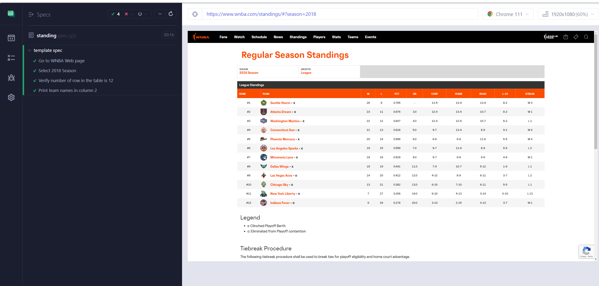

<h1>Cypress Project</h1>

The goal of this project is to create an end-to-end automation script using Cypress to test the WNBA Standings page. 

<h1>Prerequisite:</h1> Install nodejs (environmental settings) and VS code

1. Created a folder
2. Open VS Code and open folder
3. Open terminal in VS Code
4. Run ‘npm init’
5. Run ‘npm install cypress --save-dev’
6. Run ‘npx cypress open’

<h1>The script will follow these steps:</h1>

1. Load the page: https://www.wnba.com/standings/
2. Set the season to 2018
3. Assert that the number of table records is 12
4. Iterate over the table and print the team names in column 2 using cypress log API

<h1>cypress.config.js</h1>

const { defineConfig } = require("cypress");

module.exports = defineConfig({
e2e: {
setupNodeEvents(on, config) {
// implement node event listeners here
},
viewportHeight: 1080,
viewportWidth: 1920,
testIsolation: false,
},
});

This code is a configuration file for a Cypress project, which is a JavaScript-based end-to-end testing framework.
The configuration object defined in this file contains settings that are used to configure various aspects of the testing environment.
The configuration includes viewport dimensions and test isolation settings.

<h1>support/e2e.js</h1>

This is a comment block in our project that provides information about the support/e2e.js file.
It explains that this file is loaded automatically before test files, and is used for global configurations and behaviors that modify Cypress. 
The comment also mentions that the supportFile option can be used to configure the location of this file. 
The code in the block imports the ./commands module and uses Cypress.on to prevent Cypress from failing tests due to uncaught exceptions.

<h1>How to run the project</h1>

1. Open a new terminal
2. Run command npx cypress open

<h1>Screenshot of my test execution</h1>

